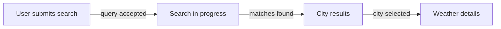

# archbusiness-v3

Generate a compact, evidence-backed knowledge base for an existing repository.

Generate exactly:

```text
docs/
├── high-level-architecture.md
├── high-level-business.md
└── modules/
    ├── <module-name>/
    │   ├── architecture.md
    │   └── business.md
    └── ...
```

For HarmonyOS / OpenHarmony / ArkTS projects, treat every directory containing `module.json5` as a physical module for this version.

Do not generate auxiliary documentation files.

## Mandatory graph-first behavior

This is a Homegraph-backed skill.

Homegraph is the primary architecture discovery source and is NOT optional enrichment.

Before broad implementation reading:
1. detect physical modules,
2. explore the repository with Homegraph,
3. explore every physical module with Homegraph,
4. use Homegraph to identify important entry points, relationships and representative runtime flows,
5. only then read source/configuration selectively.

Do not reconstruct architecture primarily by recursively enumerating and reading source files.

Do not use broad repository-wide source enumeration such as recursive `Get-ChildItem`, `Glob **/*.ets`, or equivalent as the primary discovery strategy when Homegraph is available.

## Evidence sources and precedence

Use:
1. existing repository documentation,
2. Homegraph,
3. source/configuration.

For current executable behavior, source/configuration is authoritative.
Homegraph is authoritative for the structural/call relationships it actually reports.
README/docs/comments describe declared/documented behavior.

When sources materially disagree, do not silently merge them.

### Centralized findings rule

Cross-cutting inconsistencies, suspicious behavior, stale documentation, or other material findings MUST be recorded exactly once in:

`docs/high-level-architecture.md` → `## Repository Findings`

Do not repeat the same finding in:
- `high-level-business.md`
- module architecture docs
- module business docs

Module docs may contain a short pointer such as:
`See high-level-architecture.md → Repository Findings.`

A module-local issue that truly affects only one module MAY be recorded in that module's `architecture.md`, but it must not also appear in the repository findings.

Business documents do not contain issue/inconsistency sections.

## Business extraction mode

Classify repository and each module independently as:
- `ux`
- `code-first`

The classification is internal working state. Do NOT emit headings like `UX classification` or `Code-first classification` in generated docs.

### UX mode

Use when the scope has meaningful user-facing interaction.

For each major capability, reconstruct:

```text
Trigger
→ meaningful user/business steps
→ successful outcome

Alternative paths:
- errors
- retry
- back/navigation
- empty results
- offline/cache fallback
- permissions
```

UI source determines the user-visible flow.
Homegraph determines the execution path behind important user actions.

Do not replace a user flow with a call chain.
Do not expose implementation state names (`SHOW_RESULTS`, `IDLE`, etc.) as business/domain vocabulary unless needed in evidence.

### UX flow diagram requirement

If the UX scope exposes a meaningful sequence of 3 or more user-visible states/steps, generate a Mermaid flow diagram adjacent to the corresponding flow explanation.

At repository level:
- include one concise end-to-end UX flow diagram in `high-level-business.md` when meaningful UX exists.

At UX module level:
- include one module-scoped UX flow diagram in `<module>/business.md` when meaningful UX exists.

Do not generate a UX diagram for a non-UX module.

The diagram must visualize the business/user flow, not the internal class call chain.

## Mermaid safety rules

Every generated Mermaid diagram MUST follow all of these rules.

### Flowchart / graph diagrams

- Use simple alphanumeric/underscore node IDs only: `A`, `SEARCH`, `SHOW_CITY`.
- Always wrap every visible node label in double quotes:
  - `A["Search for city"]`
- Always wrap every edge label in double quotes:
  - `A["Search"] -->|"results found"| B["Results"]`
- Always quote subgraph display labels:
  - `subgraph UI["User Interface"]`
- Never use bare labels containing `@`, `.`, `[]`, `()`, `/`, `:`, `+`, `-`, `&`, or other punctuation.
- Avoid multi-target shorthand such as `A --> B & C`; emit separate edges.
- Prefer `flowchart TD` or `flowchart LR`.
- Keep IDs independent from source-code names. Put source-code names only inside quoted labels.
- Keep labels short enough to render cleanly.

Safe example:



### Sequence diagrams

Prefer flowcharts unless a sequence diagram adds substantial value.

If using `sequenceDiagram`:
- quote participant display names: `participant U as "User"`
- keep participant IDs simple
- avoid raw source syntax in message labels
- quote message text when it contains punctuation or source identifiers

## Code-first mode

Use for libraries, APIs/services, repositories/data layers, HAR/shared packages, CLIs/tools, workers, or other non-UX scopes.

Derive behavior from:
1. actual discovered callers/public entry points,
2. Homegraph call paths,
3. inputs → processing → outputs/effects,
4. domain/persisted entities,
5. external dependencies,
6. explicit validation, thresholds, errors and fallbacks.

Do not invent hypothetical consumers.

A technical module's `business.md` should often be much shorter than a UX module's document.

## Business/architecture traceability

Business and architecture documents are two views of the same discovered behavior.

For every important process:
- business doc: user/caller meaning and observable behavior,
- architecture doc: Homegraph/source realization.

Do not duplicate the implementation chain in the business document.

## Business-content purity rules

Business docs MUST NOT treat these as business/domain concepts:
- `ViewState`
- ViewModel names
- repository/DAO/data-source classes
- UI component names
- database implementation classes

These may appear in `Key Evidence`, not in the domain vocabulary.

Business docs MUST NOT treat implementation optimizations as behavioral/business rules unless externally observable:
- `Promise.all`
- internal concurrency
- mapper sequencing
- helper decomposition
- singleton usage
- logging
- dependency injection details

Business alternative paths must describe externally meaningful outcomes.
Do not list internal implementation preconditions such as "city was not yet saved" as a user-facing alternative path.

Core capability descriptions should be business-level and should not contain class call chains.

## Conflict-aware summaries

When a documented claim conflicts with implementation:
- do not repeat the disputed documented behavior as an unqualified fact in Purpose, Core Capabilities, or process summaries,
- describe the currently observed executable behavior, or use neutral wording,
- record the disagreement once in `high-level-architecture.md` → `Repository Findings`.

## Architecture abstraction rules

Repository-level architecture describes modules and their relationships, not folder inventories.

Module `Internal Structure` should group code into at most ~4–7 meaningful architectural areas. Do not enumerate every folder/class unless needed.

Distinguish:
- external/package public surface,
- framework/application entry points,
- internal shared symbols.

Do not call an internal singleton a public module API merely because multiple files import it.

## Key Evidence

End every generated document with a concise `Key Evidence` section.

Aim for 3–8 evidence anchors.

Do not create exhaustive file inventories.

## Diagram limits

Maximum:
- 2 diagrams per repository-level document
- 1 diagram per module document

For UX business docs, the required UX flow diagram counts toward this limit.

## Workflow

Follow `workflows/full-scan-workflow.md`.

## Templates

Use:
- `templates/high-level-architecture-template.md`
- `templates/high-level-business-template.md`
- `templates/module-architecture-template.md`
- `templates/module-business-template.md`
