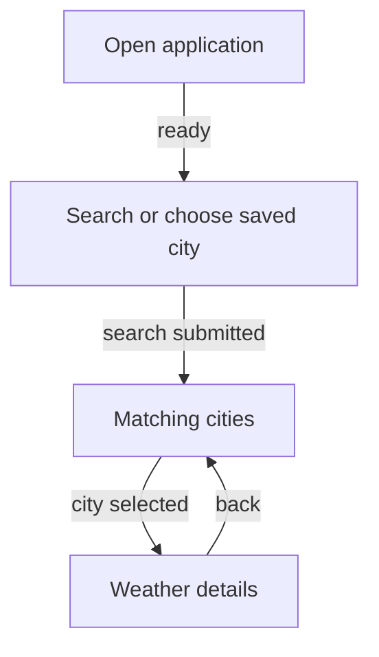
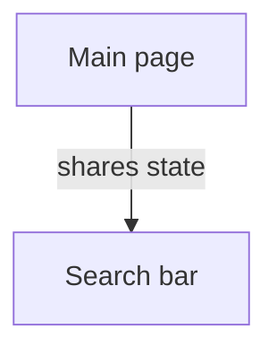

# Architecture + Business Knowledge Base Instructions

## Objective

Generate a minimal knowledge base for feature work in an existing repository.

This version is descriptive and diagnostic. It does not yet enforce architecture rules or generate ADRs.

## 1. Detect physical boundaries

For HarmonyOS, locate `module.json5` files and record their containing physical modules.

Do not recursively enumerate all source files as the primary discovery strategy.

## 2. Homegraph-first discovery

Before broad source reading:

1. run a repository-level Homegraph exploration,
2. run at least one Homegraph exploration for every physical module,
3. identify important entry points,
4. identify cross-module dependencies,
5. identify representative runtime/data flows,
6. identify candidate UX entry points and user-facing flows.

Use Homegraph to select which source files need verification.

## 3. Read existing declared documentation

Read the root README and obvious existing architecture/business/design docs.

Treat these as declared behavior.

Do not assume documentation is current.

## 4. Selective source verification

Read source/config only to verify:
- module metadata,
- UI state/navigation/events,
- constants/thresholds,
- error/fallback behavior,
- persistence schemas,
- API configuration,
- ambiguous graph findings,
- public/exported surfaces.

## 5. Evidence reconciliation

Track three kinds of evidence:
- declared/documented,
- graph-observed,
- source-observed.

For current executable behavior, prefer source/config.

If sources materially disagree, create one repository-level finding.

### Finding ownership

All cross-cutting findings go only in:

`docs/high-level-architecture.md` → `## Repository Findings`

Do not duplicate them in module or business docs.

A finding belongs in a module architecture document only if it is genuinely local to that module and not relevant to repository-level behavior.

Business docs never contain an inconsistency/findings section.

### Finding format

```markdown
## Repository Findings

### <Finding title>
- **Declared/documented:** ...
- **Observed implementation:** ...
- **Why it matters:** ...
- **Affected scope:** ...
```

Avoid speculative root-cause analysis.

## 6. Classify each scope internally

Choose `ux` or `code-first`.

Never emit this classification as a document heading.

## 7. UX-backed business reconstruction

For each important UX capability:

1. identify the user trigger,
2. reconstruct the meaningful user-visible steps,
3. identify the successful outcome,
4. identify user-visible alternatives/failures,
5. map the flow to its Homegraph execution path,
6. verify exact behavior from targeted source reads.

### Required UX diagram

If there are 3+ meaningful steps/states, generate a Mermaid flowchart immediately after the textual flow.

The diagram must show user/business progression, not classes.

Example:



### Mermaid syntax requirements

For every flowchart:
- simple IDs only,
- every node label double-quoted,
- every edge label double-quoted,
- every subgraph label double-quoted,
- one edge per line,
- no `A --> B & C`,
- avoid raw ArkTS/TypeScript expressions in labels.

Unsafe:

```mermaid
graph TD
  A[Index.ets] -->|@Link| B[SearchBarComponent]
```

Safe:



## 8. Code-first business reconstruction

Start from actual discovered callers/public entry points and Homegraph paths.

For each representative operation:

```text
Input/trigger
→ meaningful processing
→ output/effect

Alternatives/failures
```

Do not invent hypothetical consumers.

Do not turn implementation details into business rules.

## 9. Business-document filters

Before emitting a business statement, ask:

### Is this a domain/business concept?
Allowed:
- City
- Weather
- Forecast
- Search history
- Cache freshness if behaviorally relevant

Usually not allowed:
- ViewState
- WeatherViewModel
- DAO
- repository pattern
- mapper
- relationalStore class

### Is this an observable rule?
Allowed:
- data older than N minutes is refreshed
- empty search is ignored
- failed city search shows an error
- cached data is reused while fresh

Not business rules:
- current and forecast are fetched with `Promise.all`
- DAOs run concurrently
- repository is singleton
- mappers convert records

### Is this really an alternative path?
Alternative path = user/caller sees a different outcome.

Internal preconditions such as "city was not saved yet" belong in architecture, not business flow alternatives.

## 10. Conflict-aware writing

If documentation says behavior X but source implements behavior Y:

Do NOT write X as fact in:
- Purpose
- Core Capabilities
- successful outcomes
- behavioral rules

Write the observed executable behavior or neutral phrasing.

Record X vs Y once in Repository Findings.

## 11. Architecture abstraction

### High-level

Show:
- physical module responsibilities,
- module relationships,
- major integrations,
- data/state ownership,
- key runtime flows.

Do not reproduce per-class/folder inventories.

### Module

Group Internal Structure into 4–7 architectural areas where possible.

For public surfaces, explicitly distinguish:
- external package exports,
- application/framework entry points,
- internal shared symbols.

## 12. Deduplication

High-level docs should summarize module behavior, not replay module details.

Business docs should not repeat architecture call chains.

Repository findings should exist in one location only.

## 13. Review checklist

Before finishing verify:
- Homegraph used first,
- every module explored,
- UX diagrams present where meaningful,
- Mermaid syntax follows quoting rules,
- no issue is duplicated across files,
- no classification headings are emitted,
- no technical implementation concepts are presented as domain concepts,
- no technical optimization is labeled a business rule,
- disputed documented behavior is not presented as fact,
- module public surfaces are classified correctly,
- internal structure is grouped rather than inventoried.
