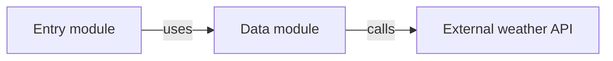

# High-Level Architecture

## System Responsibility
Concise technical responsibility of the repository.

## Technology and Runtime
Only major technologies/runtime facts needed to understand implementation.

## Module Map
For each physical module:
- module name/type
- technical responsibility
- major incoming/outgoing relationships

Optionally include one Mermaid module diagram.

Mermaid must use safe quoted labels, e.g.:

## Important Entry Points
Main application/framework/package entry points only.

## Architectural Relationships
Significant cross-module/component relationships discovered primarily from Homegraph.

## Data and State
Important state ownership, persistence boundaries and caches.

## External Integrations
Important external APIs, SDKs, platform systems and databases.

## Key Runtime Flows
A small number of architecturally significant flows corresponding to processes/operations in `high-level-business.md`.

Optionally include one additional Mermaid diagram.

## Existing Architectural Patterns
Only patterns clearly demonstrated by current code.

## Repository Findings
Single canonical location for cross-cutting:
- documentation/source conflicts,
- graph/source conflicts,
- suspicious behavior with repository-level impact,
- stale declared behavior.

Format:

### <Finding title>
- **Declared/documented:** ...
- **Observed implementation:** ...
- **Why it matters:** ...
- **Affected scope:** ...

Do not duplicate these findings in other generated documents.

Omit this section when no material findings exist.

## Key Evidence
3–8 important evidence anchors.
