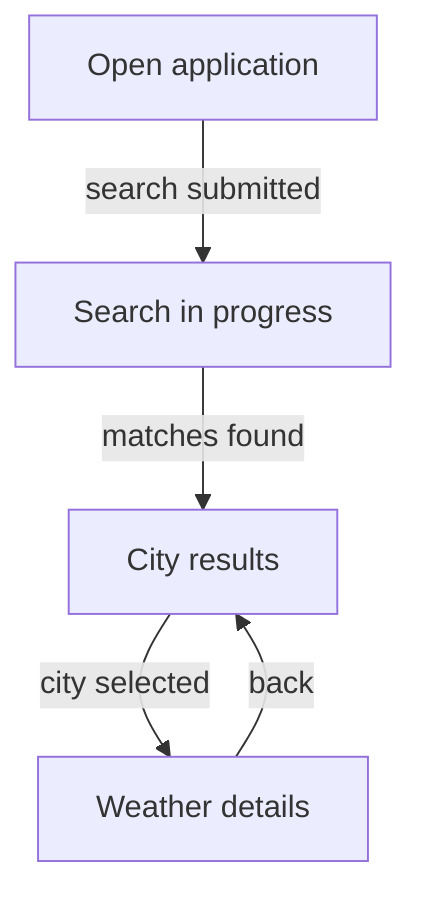

# High-Level Business Specification

## Purpose
Concise description of the value/capability delivered by the repository.

If declared documentation conflicts with source behavior, do not repeat disputed behavior as an unqualified fact.

## Actors / Callers
Only actually evidenced actors/callers.

## Core Capabilities
Business-level capability names and outcomes.

Do not include class names or call chains here.

## Core Processes / Operations

For each important UX process:

#### <Process name>

**Trigger:** ...

**Flow:**
1. ...
2. ...
3. ...

**Successful outcome:** ...

**Alternative paths:**
- ...
- ...

If the process has 3+ meaningful user-visible steps, add a Mermaid flowchart immediately after its textual explanation.

Example:

For code-first repositories, use:
- Input/trigger
- Processing
- Output/effect
- Alternatives/failures

Do not emit classification headings.

## Domain Concepts
Only business/domain concepts.

Do not include ViewState, ViewModel, repository, DAO, data-source, or UI component concepts.

## Explicit Behavioral Rules
Only rules that materially affect observable/domain behavior.

Do not include implementation concurrency or internal technical sequencing.

## Failure and Alternative Behavior
Externally meaningful failure/fallback/offline/empty/retry behavior not already clear in process sections.

## Capability to Module Mapping
Map capabilities to physical modules without class-level implementation detail.

Do not include an issue/inconsistency section here.
Cross-cutting findings live only in `high-level-architecture.md`.

## Key Evidence
3–8 important evidence anchors, including relevant Homegraph paths.
