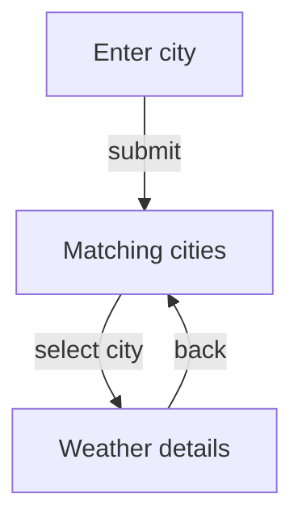

# Module Business Specification — <module-name>

## Business Contribution
What repository/product capability this module implements or supports.

Technical modules may be brief.

## Actors / Callers
Only actually evidenced users/callers.

Do not invent hypothetical consumers.

## Capabilities / Operations
Meaningful outcomes provided or supported by the module.

Do not put class names/call chains in capability descriptions.

## Processes / Flows

### UX scope

For each important flow:

#### <Flow name>

**Trigger:** ...

**Flow:**
1. ...
2. ...
3. ...

**Successful outcome:** ...

**Alternative paths:**
- ...
- ...

If there are 3+ meaningful user-visible steps, add one Mermaid user-flow diagram.

Example:

The diagram must show user/business flow, not classes.

### Code-first scope

For each representative operation:

#### <Operation name>

**Input/trigger:** ...

**Processing:** ...

**Output/effect:** ...

**Alternatives/failures:** ...

## Domain Concepts
Only business/domain concepts.

Do not include ViewState, ViewModel, DAO, repository/data-source classes, or implementation-specific state.

## Explicit Behavioral Rules
Only externally/domain meaningful rules.

Do not include:
- `Promise.all`
- internal concurrency
- mapper ordering
- singleton usage
- dependency injection details

## Relationship to Repository Capabilities
Map this module to high-level capabilities.

Do not include issue/inconsistency sections in business docs.

## Key Evidence
3–8 important evidence anchors.
