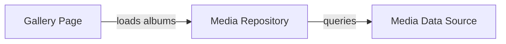
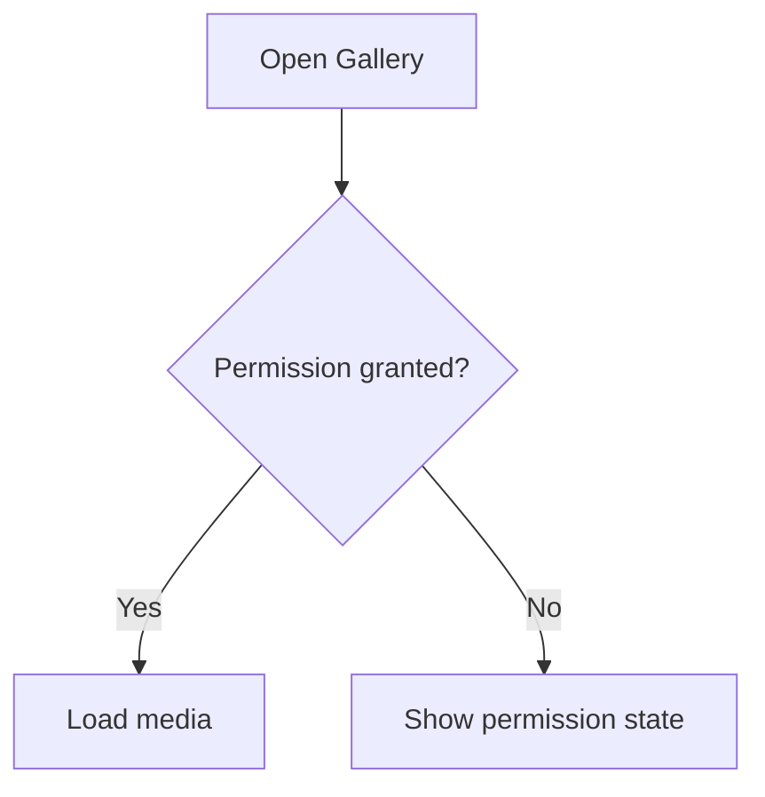
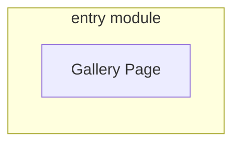

# Mermaid Diagram Rules

Use Mermaid selectively. Diagrams should reduce reading time, not decorate every document.

## Expected density

Typical starting point:

- Project Architecture: usually 1 module/dependency diagram; more only for distinct useful questions.
- Project Business: usually 1 primary end-to-end flow when the Project has a meaningful process.
- Module Architecture: only when a runtime/data/state flow is materially clearer visually.
- Module Business: only for meaningful branching/stateful UX/domain flow.

It is acceptable to have more diagrams when each one explains a separate important flow and remains compact.

## Safe Mermaid syntax

Prefer `flowchart`, `stateDiagram-v2`, and `sequenceDiagram` only when appropriate.

For flowcharts, use simple alphanumeric IDs and **quote every human-readable node label**:



For decisions:



For subgraphs, quote the label:



Rules:

- node labels: `id["Label"]`, `id{"Decision?"}`, `id(["Label"])` where supported;
- edge labels: always `-->|"label"|` rather than unquoted `-->|label|`;
- subgraph labels: `subgraph id["Label"]`;
- avoid punctuation-heavy IDs; put punctuation in quoted labels;
- avoid raw generic type syntax, braces, pipes, HTML, filesystem paths, and quotes inside unescaped labels;
- avoid multi-target shorthand such as `A --> B & C`;
- keep arrows directional and semantically meaningful;
- split diagrams that become dense rather than relying on complex syntax.

## Architecture diagrams

Show boundaries/dependency direction, not every class. Distinguish:

- module/project;
- platform/native/external system;
- direction such as depends-on, calls, publishes, persists.

One diagram should answer one question.

## Business diagrams

Show user/caller steps, states, decisions, outcomes, and module/platform handoffs. Hide low-level class/repository internals unless the handoff itself is business-relevant.

## Validation

For every Mermaid block:

1. fence opens exactly with ```` ```mermaid ```` and closes;
2. diagram declaration is supported;
3. flowchart node/subgraph/edge labels use conservative quoting above;
4. no placeholder text remains;
5. links/direction are checked against evidence;
6. if a local Mermaid renderer is already available, render/parse it; do not install one during generation;
7. otherwise rely on conservative syntax plus `scripts/validate_docs.py` structural checks.

If validation fails, simplify the Mermaid instead of making the syntax more clever.
