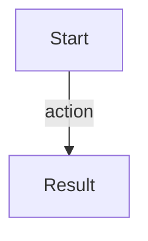

<!-- PROJECTSPEC:GENERATED:START -->
# Module Business — <module>

> Scope: `<project/module path>`  
> Baseline: `<revision>`  
> Business role: `behavior-owner | supporting-behavior`  
> Project: [Business](<relative-project-business-link>) · [Architecture](<relative-project-architecture-link>)

Use this template only when semantic analysis justifies a standalone module Business document. Do not create it for technical storage/helpers/models alone.

## Role in the Product

Explain the independently useful UX/domain behavior this module contributes and its boundary. For `supporting-behavior`, make clear which Project journey it supports rather than inventing a separate product capability.

## User / Domain Flows

Describe the important flow(s) from trigger to observable result. Use UX states/navigation when UI exists; otherwise use a domain/system journey.

### <Flow name>

**Trigger / preconditions:** <...>

1. <domain/user step>
2. <decision/state/data effect>
3. <observable result or exact external/platform handoff>

**Material alternatives / failures:** <only meaningful branches>

<!-- Optional Mermaid only when useful; quote all labels safely.

-->

## Business Concepts and Data

| Concept | Business meaning / lifecycle | Produced or consumed here |
|---|---|---|

## Rules, States, and Outcomes

Include only observable decisions/states that materially explain behavior. A compact table is preferred when several comparable rules/states exist.

<!-- Optional: include only when needed to understand a cross-module journey
## Interaction with Other Modules
-->

## Source Evidence

| Behavior/claim | Evidence anchor | What it establishes |
|---|---|---|
<!-- PROJECTSPEC:GENERATED:END -->
