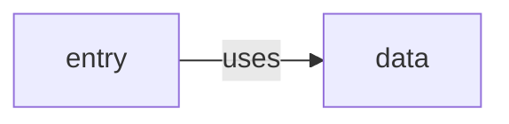

<!-- PROJECTSPEC:GENERATED:START -->
# Project Architecture — <project>

> Scope: `<project path>`  
> Baseline: `<revision>`  
> Governance: [Constraints and limitations](constraints-and-limitations.md)  
> Business: [Project Business](business.md)

## Project Boundary and Architecture

Explain what this Project is at runtime/build level, its architectural style as observed, its external/public boundary, and the safest high-level starting points for feature work.

## Module Responsibilities and Dependency Direction

| Module | Responsibility | Depends on | Used by | Detail |
|---|---|---|---|---|

Include every physical module/build unit and link its Architecture document.

Normally include one compact Mermaid dependency view:

Replace the example with evidence-backed nodes/edges. Quote every node/edge/subgraph label.

## Cross-Module Runtime and Data Flows

Describe 2-4 representative Project-level paths that explain how modules compose. Link to module Architecture for local detail rather than repeating internals.

## External, Platform, and Native Boundaries

Include only materially important boundaries: platform services, native libraries, external systems, sibling Projects/local packages, public contracts.

## Change Ownership Map

| Change area | Start in | Why | Related module docs / ARC-CHK IDs |
|---|---|---|---|

Keep this practical and compositional. Detailed extension patterns belong in module Architecture; durable rules/checks belong in governance.

## Source Evidence

| Architecture claim | Evidence anchor | What it establishes |
|---|---|---|
<!-- PROJECTSPEC:GENERATED:END -->
