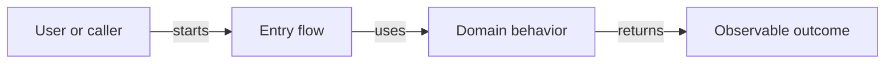

<!-- PROJECTSPEC:GENERATED:START -->
# Project Business — <project>

> Scope: `<project path>`  
> Baseline: `<revision>`  
> Architecture: [Project Architecture](architecture.md)

## Purpose and Observable Boundary

Explain what the Project does for users/callers/the surrounding system, what is in scope, and what outcome/value it provides today.

## Actors and Main Journeys

Identify the primary actors/callers and describe the important end-to-end As-Is journeys. Project Business owns cross-module flows and also absorbs meaningful contributions from modules that do not justify their own Business file.

### <Journey name>

**Actor/caller:** <...>  
**Trigger / preconditions:** <...>

1. <user/domain step and owning module>
2. <state/decision/data handoff>
3. <observable result or exact external/platform handoff>

**Material alternatives / failures:** <...>

Usually include one primary Project journey diagram when useful:

Replace the example with evidence-backed labels/edges. Omit the diagram when it adds no value.

## Module Contributions

| Module | Business contribution | Standalone Business detail |
|---|---|---|

For modules with their own Business file, summarize and link. For `project-grouped` supporting behavior, explain enough here that the Project journey remains complete.

## Business Concepts and Data

| Concept | Meaning / lifecycle | Relevant journey(s) |
|---|---|---|

## Rules, States, Failures, and Outcomes

Capture the few cross-module/user-visible decisions and states needed to understand Project behavior. Avoid implementation-only guardrails; those belong in Architecture/Governance.

## Source Evidence

| Journey/claim | Evidence anchor | What it establishes |
|---|---|---|
<!-- PROJECTSPEC:GENERATED:END -->
