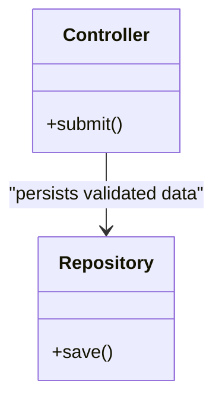

# Conservative Mermaid

Supported blocks are `flowchart`, `stateDiagram-v2`, `sequenceDiagram`, and `classDiagram`.
Use quoted labels for human-readable nodes and edge labels. Generate a class diagram only
when a small set of classes/contracts/state relationships answers an explicit architectural
question; record the question and evidence in the packet. Do not dump every class.

Business diagrams show user/domain outcomes; Architecture diagrams show technical ownership,
runtime, data, or contracts. Every relationship must have a source/evidence anchor.
