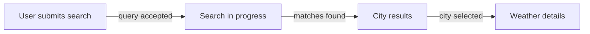

# generate-projectspec

Generate a compact, evidence-backed knowledge base for an existing repository.

Generate exactly:

```text
docs/
├── high-level-architecture.md
├── high-level-business.md
└── modules/
    ├── <module-name>/
    │   ├── architecture.md
    │   └── business.md
    └── ...
```

For HarmonyOS / OpenHarmony / ArkTS projects, treat every directory containing `module.json5` as a physical module for this version.

Do not generate auxiliary documentation files.

## Mandatory graph-first behavior

This is a Homegraph-backed skill.

Homegraph is the primary architecture discovery source and is NOT optional enrichment.

Before broad implementation reading:
1. detect physical modules,
2. explore the repository with Homegraph,
3. explore every physical module with Homegraph,
4. use Homegraph to identify important entry points, relationships and representative runtime flows,
5. only then read source/configuration selectively.

Do not reconstruct architecture primarily by recursively enumerating and reading source files.

Do not use broad repository-wide source enumeration such as recursive `Get-ChildItem`, `Glob **/*.ets`, or equivalent as the primary discovery strategy when Homegraph is available.

## Evidence sources and precedence

Use:
1. existing repository documentation,
2. Homegraph,
3. source/configuration.

For current executable behavior, source/configuration is authoritative.
Homegraph is authoritative for structural/call relationships it actually reports.
README/docs/comments describe declared/documented behavior.

When sources materially disagree, do not silently merge them.

## Centralized findings rule

Cross-cutting findings MUST be recorded exactly once in:

`docs/high-level-architecture.md` → `## Repository Findings`

Do not repeat the same finding in business docs or multiple module docs.

A module-local issue that truly affects only one module MAY be recorded in that module's `architecture.md`.

Business documents do not contain issue/inconsistency sections.

### Finding categories

Inside `Repository Findings`, classify findings as:

#### Observed Inconsistencies
Use for:
- documentation vs source disagreements,
- Homegraph vs source disagreements,
- stale declared behavior,
- conflicting configuration/implementation evidence.

#### Architecture Concerns
Use for evidence-backed:
- security concerns,
- coupling concerns,
- maintainability concerns,
- public-surface concerns,
- robustness concerns,
- architectural smells.

Do not call an architecture concern an inconsistency.

### Finding promotion rule

Promote a module-local finding to repository level when it affects:
- user-visible behavior,
- repository-level capabilities,
- cross-module contracts,
- persistence/cache semantics,
- runtime behavior,
- build/test/CI behavior,
- shared public surface.

Group related findings about the same behavior.

## Build / run / test / CI discovery is mandatory

Repository documentation MUST include practical developer workflow instructions when the repository contains enough evidence.

Inspect, as applicable:
- `hvigorw`, `hvigorw.bat`, `hvigorfile.ts`,
- `build-profile.json5`,
- root/module `oh-package.json5`,
- package scripts/task definitions,
- test directories/configuration,
- all `.github/workflows/*.yml` / `.yaml`,
- other CI configuration,
- README setup/build/run/test instructions.

Generate `Build, Run, Test, and CI` in `high-level-architecture.md`.

Include:
- setup/install steps,
- build command(s),
- run/launch procedure if evidenced,
- test command(s),
- useful module-specific variants,
- CI workflow names/triggers/jobs,
- what CI validates,
- what CI does NOT validate when evident.

Never invent commands.

When documenting CI coverage gaps, inspect the complete discovered workflow set first.

For HarmonyOS repositories, prefer actual wrapper commands such as `./hvigorw ...` or `hvigorw.bat ...` when present.

## Business extraction mode

Classify repository and each module independently as:
- `ux`,
- `code-first`.

The classification is internal working state. Do NOT emit classification headings.

## Research-driven UX reconstruction

For every UX scope, follow this method in order.

### 1. Identify the state/process skeleton
Recover meaningful UI/application states from:
- state enums,
- routes/pages,
- conditional rendering,
- navigation,
- loading/error/empty states,
- lifecycle behavior.

### 2. Identify transitions and triggers
For each transition determine:
- user action or system event,
- source state,
- destination state,
- observable meaning.

### 3. Identify data dependencies
Determine what data must exist or be produced for each meaningful state/outcome.

### 4. Extract behavioral/business rules
Capture explicit conditions that alter user-visible/domain outcomes:
- freshness thresholds,
- validation,
- access rules,
- fallback/offline behavior,
- state restrictions.

### 5. Cross-reference architecture
Use Homegraph and targeted source reads to map each important UX transition/process to its actual execution path.

Architecture explains HOW.
Business documentation explains WHAT happens and WHAT outcome is delivered.

### 6. Validate completeness
Check:
- happy path,
- alternative path(s),
- errors,
- retry,
- back/navigation,
- empty states,
- offline/cache behavior,
- permissions if relevant.

Do not invent missing flows.

## UX process representation

For each important process, business docs should use:

```text
Trigger
→ meaningful user/business steps
→ successful outcome

Alternative paths:
- errors
- retry
- back/navigation
- empty results
- offline/cache fallback
- permissions
```

Translate implementation state names into business meaning.

Do not replace a user flow with a call chain.

Do not collapse two distinct observed UI states into one business state when that changes what the user sees or what navigation becomes available.

## Canonical business diagram purity

The repository-level business diagram must show business/user states and value delivery only.

Do NOT put implementation mechanisms in the canonical business diagram, including:
- cache checks,
- database writes,
- HTTP/API calls,
- repository/data-source decisions,
- DTO mapping,
- concurrency.

Prefer:
`User action → business/system operation → user-visible outcome`

Implementation branches belong in:
- architecture diagrams,
- `Explicit Behavioral Rules`,
- runtime-flow sections in architecture docs.

## UX diagram hierarchy

Avoid repeating the same diagram at repository and module level.

### Repository-level business diagram
Show the canonical end-to-end business/value-delivery process across relevant system behavior.

### Module-level business diagram
Generate only if it adds detail not already shown by the repository diagram.

Good module-level detail includes:
- state/navigation flow,
- module-local sub-process,
- distinct alternative/error path.

If the module's UX flow is effectively identical to the repository-level flow, OMIT the module diagram.

### State diagram labels

Module UX diagrams may be derived from implementation state machines, but visible labels must use user/business meanings.

Prefer:
- `HOME["Home / search history"]`
- `RESULTS["Search results"]`

Avoid:
- `IDLE["IDLE"]`
- `SHOW_RESULTS["SHOW_RESULTS"]`

Technical enum names may appear in `Key Evidence`.

## Mermaid safety rules

Every Mermaid diagram MUST follow these rules.

### Flowchart / graph diagrams
- Use simple alphanumeric/underscore node IDs only.
- Always wrap every visible node label in double quotes.
- Always wrap every edge label in double quotes.
- Always quote subgraph display labels.
- Never use bare labels containing punctuation or source syntax.
- Avoid multi-target shorthand such as `A --> B & C`; emit separate edges.
- Prefer `flowchart TD` or `flowchart LR`.
- Keep labels concise.

Safe example:



## Code-first mode

Use for libraries, APIs/services, repositories/data layers, HAR/shared packages, CLIs/tools, workers, or other non-UX scopes.

Derive behavior from:
1. actual discovered callers/public entry points,
2. Homegraph call paths,
3. inputs → processing → outputs/effects,
4. domain/persisted entities,
5. external dependencies,
6. explicit validation, thresholds, errors and fallbacks.

Do not invent hypothetical consumers.

A technical module's `business.md` should often be much shorter than a UX module's document.

### Code-first semantic abstraction

In code-first business docs, describe operations one abstraction level above source implementation.

Prefer:
- "Resolve the city query using the configured geocoding service."
- "Retrieve current conditions from the configured weather provider."

Avoid:
- "Build a Nominatim URL and issue an HTTP GET."
- "Call `WeatherAPI.getForecast()`."

Exact endpoint/protocol/class details belong in architecture.

## Semantic cleanliness rules

### Business actor purity

For UX applications:
- `Actors` contains human or genuinely external actors interacting with the product.
- Do NOT list internal modules, repositories, ViewModels, services, data layers, or UI components as actors.
- Internal collaborators belong in architecture or capability-to-module mapping.

For code-first libraries/services:
- use `Callers` when appropriate,
- callers must be evidence-backed,
- do not invent hypothetical consumers.

### Domain concept purity

A domain concept is a business/data concept, not a screen or technical implementation artifact.

Prefer concepts such as:
- City,
- Weather,
- Forecast,
- Search history.

Avoid as domain concepts:
- City details screen,
- Results screen,
- ViewState,
- ViewModel,
- Repository,
- DAO,
- Mapper,
- UI component classes.

Policy-like notions such as freshness, retention, timeout, or retry should usually live in `Explicit Behavioral Rules`, not `Domain Concepts`, unless they are clearly modeled as first-class domain concepts in the repository.

### Process vs rule separation

Keep the happy-path process focused on user-visible value delivery.

Move reusable conditions such as:
- cache thresholds,
- persistence/upsert rules,
- validation rules,
- fallback behavior,
- refresh rules

into `Explicit Behavioral Rules` unless they directly define a visible branch in the process.

### High-level business rule threshold

A rule belongs in `high-level-business.md` only if it materially affects:
- what the user/caller can do,
- what result they receive,
- when observable behavior changes,
- a product-level domain policy.

Move implementation-owned rules such as:
- upsert semantics,
- overwrite semantics,
- table-level persistence behavior,
- repository-internal sequencing

to the owning module's business or architecture document unless they affect repository-level observable behavior.

### Alternative-path purity

Business alternative paths must describe externally meaningful outcomes.

Do not list internal implementation preconditions unless they produce a distinct caller/user-visible outcome.

## Architectural precision rules

### Evidence-strength wording

Do not claim architecture is:
- strict,
- enforced,
- guaranteed,
- impossible to bypass

unless the repository contains an enforcement mechanism or analysis proves it comprehensively.

Prefer wording such as:
- "Observed dependency direction is..."
- "Current code routes access through..."
- "Homegraph shows..."
- "The current implementation uses..."

### Public surface classification

Distinguish:
- external/package exports,
- framework/application entry points,
- internal shared symbols.

Do not call an internal singleton a public module API merely because multiple files import it.

If a module publicly exports lower-level implementation components in addition to a higher-level facade, explicitly call this out.

### Internal structure abstraction

Module `Internal Structure` should group code into ~4–7 meaningful architectural areas.

Group by responsibility, not by folder size or source-tree shape.

Avoid distinctions such as:
- "small UI widgets",
- "large UI widgets",
unless that distinction is architecturally meaningful.

## Conflict-aware summaries

When a documented claim conflicts with implementation:
- do not repeat disputed documented behavior as an unqualified fact in Purpose, Core Capabilities, or process summaries,
- describe current executable behavior or neutral wording,
- record the disagreement once in `Repository Findings`.

## Agent usability rules

Optimize generated docs for future feature work:
- important facts should be easy to find,
- related findings should be grouped,
- high-level docs should not repeat module detail,
- business docs should not replay architecture call chains,
- build/test/CI gaps should be explicit,
- capability-to-module mapping should be concise and actionable.

## CI coverage gaps

In `Build, Run, Test, and CI`, explicitly state what CI validates and what it does not validate when evident.

Before stating a gap, inspect all discovered workflow files.

Examples:
- builds successfully,
- packages/signs output,
- runs unit tests,
- does not run tests,
- does not lint,
- does not perform architecture checks.

## Business/architecture traceability

Business and architecture documents are two views of the same discovered behavior.

For every important process:
- business doc: user/caller meaning and observable behavior,
- architecture doc: Homegraph/source realization.

Do not duplicate implementation call chains in business docs.

## Key Evidence

End every generated document with a concise `Key Evidence` section.

Aim for 3–8 evidence anchors.

Do not create exhaustive file inventories.

## Diagram limits

Maximum:
- 2 diagrams per repository-level document,
- 1 diagram per module document.

For UX business docs, a UX flow diagram counts toward this limit.

## Workflow

Follow `workflows/full-scan-workflow.md`.

## Templates

Use:
- `templates/high-level-architecture-template.md`
- `templates/high-level-business-template.md`
- `templates/module-architecture-template.md`
- `templates/module-business-template.md`
